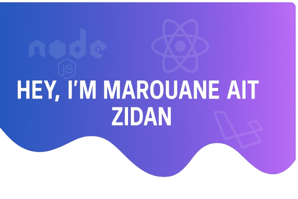

  

<h1 align="center">
  Hey there! I'm Marouane 
</h1>

  <b>Full-Stack Developer &nbsp;|&nbsp; Tech Enthusiast &nbsp;|&nbsp; AI Explorer</b>

  <i>Building interactive web apps, exploring AI, and passionate about tech entrepreneurship.</i>

## 💫 About Me
- 🔭 **Currently working on**: Web development projects blending tech and management for my Bachelor's in *Informatique Appliquée au Management*.
- 👯 **Open to collaborate on**: Innovative web apps—think real-time features, interactivity, or data-driven tools.
- 🤝 **Seeking help with**: Backend architecture, scalable authentication, and integrating AI-powered features.
- 🌱 **Learning**: Advanced Laravel, React.js, Socket.IO, and diving into AI & Big Data.
- 💬 **Ask me about**: Full-stack dev with Laravel & React, databases (Supabase, MySQL), UI prototyping (Figma), or Git/GitHub workflows.
- ⚡ **Fun fact**: I'm a tech entrepreneurship enthusiast—love flipping domains and building problem-solving tools!

---

## 💻 Tech Stack

### Programming Languages
      

### Frameworks & Libraries
      

### Databases & Tools
       

### Platforms & Dev Tools
     

---

## 📊 GitHub Stats

  
   
  
   
  

---

## 🏆 GitHub Trophies

  

---

## ✍️ Random Dev Quote

  

---

## 🔝 Top Contributed Repos

  

---

## 🐍 Contribution Snake

  <picture>
    <source media="(prefers-color-scheme: dark)" srcset="https://raw.githubusercontent.com/marouane-ait-zidan/marouane-ait-zidan/output/github-snake-dark.svg" />
    <source media="(prefers-color-scheme: light)" srcset="https://raw.githubusercontent.com/marouane-ait-zidan/marouane-ait-zidan/output/github-snake.svg" />
    
  </picture>

---

  <i>Proudly crafted with GPRM (https://gprm.itsvg.in)</i>

